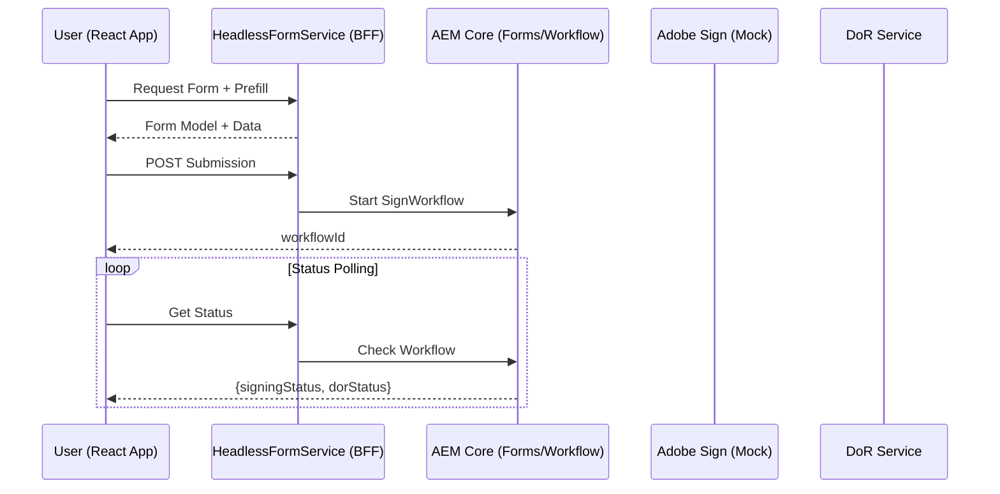

# Omnichannel Sign & DoR Architecture

```mermaid
sequenceDiagram
    participant U as User (React App)
    participant BFF as HeadlessFormService (BFF)
    participant AEM as AEM Core (Forms/Workflow)
    participant SIG as Adobe Sign (Mock)
    participant DOR as DoR Service

    U->>BFF: Request Form + Prefill
    BFF-->>U: Form Model + Data
    U->>BFF: POST Submission
    BFF->>AEM: Start SignWorkflow
    AEM-->>U: workflowId
    loop Status Polling
        U->>BFF: Get Status
        BFF->>AEM: Check Workflow
        AEM-->>U: {signingStatus, dorStatus}
    end
```
