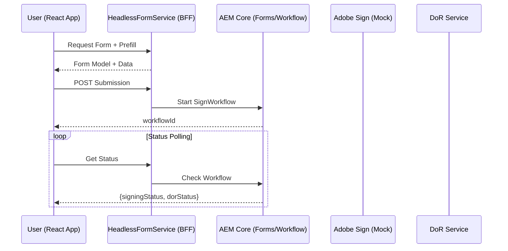

# Omnichannel Sign & DoR Architecture

> **Status**: this sequence diagram is broadly accurate for the Sign+DoR
> flow (`SignToDoRProcess`, `HeadlessSubmitServlet`) — both are real,
> live-verified code, not mocked. The one label to correct: "Adobe Sign
> (Mock)" below is stale — `AdobeSignOrchestratorImpl` makes real Adobe
> Sign REST API calls now, though it hasn't been proven against a real
> Adobe Sign account yet. See `README.md#adobe-sign-integration`.

